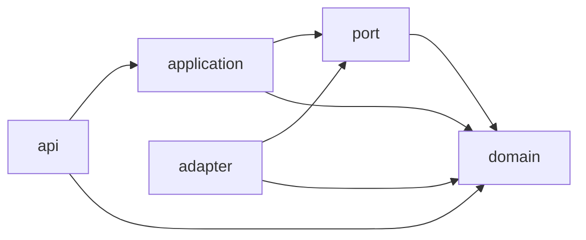
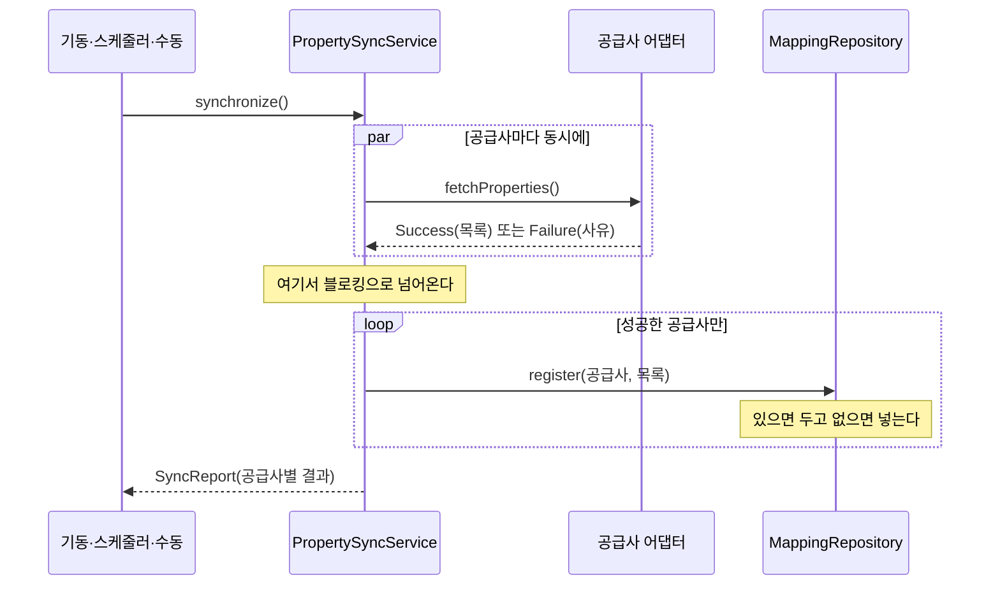
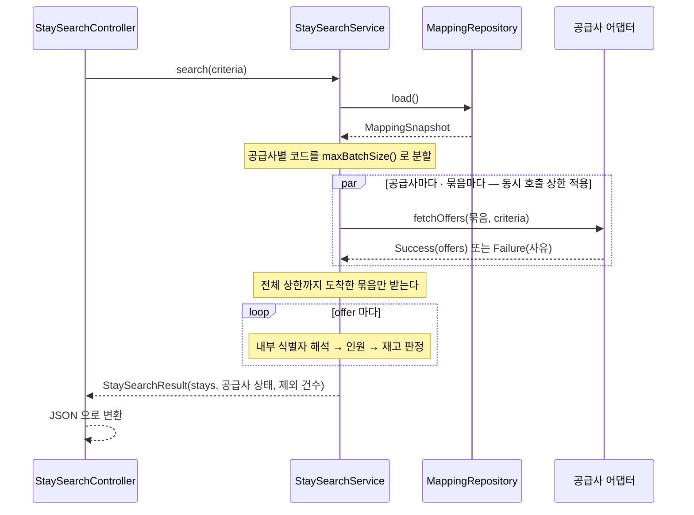

# 아키텍처

계층 의존 방향, 패키지 맵, 흐름, 테스트 전략을 적는다. **왜 그렇게 정했는지는
[README](../README.md) 에 있다.** 여기에는 그 결정이 어떤 모양인지만 쓴다.

---

## 계층과 의존 방향

화살표는 "컴파일 시점에 알고 있다"는 뜻이다. 반대 방향 화살표는 없다.

| 계층 | 아는 것 | 모르는 것 |
| --- | --- | --- |
| `domain` | 자기 자신뿐 | Spring, HTTP, DB, 공급사 |
| `port` | `domain` | 구현체가 몇 개인지, 누가 구현하는지 |
| `adapter` | `port`, `domain` | 다른 어댑터, `application`, `api` |
| `application` | `port`, `domain` | 어느 공급사인지, HTTP, JSON |
| `api` | `application`, `domain` | 공급사, DB |

`domain` 에는 Spring 어노테이션이 하나도 없다. 요금 합산 규칙이나 연박 재고 판정을 확인하는 데
컨텍스트를 띄울 필요가 없다는 뜻이다.

---

## 패키지 맵

| 패키지 | 책임 | 대표 타입 |
| --- | --- | --- |
| `domain` | 표준 모델과 판정 규칙 | `StayPrice`, `Availability`, `DateRange`, `Money`, `Stay`, `MappingSnapshot` |
| `port` | 바깥과 만나는 경계(인터페이스와 그 자료형) | `SupplierAdapter`, `MappingRepository`, `SupplierFetchResult`, `FailureReason` |
| `adapter.a` | 공급사 A 연동 | `SupplierAAdapter`, `SupplierAMapper`, `SupplierAResponses` |
| `adapter.support` | 어댑터 공통 도구 | `SupplierWebClients`, `HttpFailures`, `SupplierHttpProperties` |
| `adapter.persistence` | 매핑 저장소 구현 | `JdbcMappingRepository` |
| `application` | 유스케이스 조립 | `StaySearchService`, `PropertySyncService`, `PropertySyncSchedule` |
| `api` | HTTP 표현 | `StaySearchController`, `StaySearchResponse`, `SyncController`, `ApiErrorHandler` |

---

## 경계를 무엇이 강제하는가

규약으로만 두면 지켜지지 않는다. 아래 셋은 **컴파일러나 타입이 강제**한다.

| 경계 | 장치 |
| --- | --- |
| 공급사 DTO 가 밖으로 새지 않는다 | `SupplierAResponses` 가 package-private. 다른 패키지에서 참조하면 컴파일되지 않는다 |
| 실패를 빠뜨리지 않는다 | `SupplierFetchResult` 가 `sealed`. `switch` 에서 성공/실패를 모두 다루지 않으면 컴파일되지 않는다 |
| 내부 식별자가 흔들리지 않는다 | 매핑 테이블의 unique 제약([schema.sql](../src/main/resources/schema.sql)) |

`SupplierOffer` 는 공급사 코드를 그대로 들고 있고, `Stay` 는 내부 식별자만 들고 있다. **타입이
바뀌는 자리가 곧 정체가 확정되는 자리**다.

---

## 흐름 1 — 숙소 목록 동기화

저장을 병렬 구간 밖에서 하는 이유는 JDBC 가 블로킹이기 때문이다. 리액터 스레드에서 저장하면
다른 공급사의 응답을 기다리는 스레드를 붙잡는다.

실패한 공급사의 기존 매핑은 건드리지 않는다. 목록을 못 받은 것과 그 공급사가 숙소를 접은 것은
구분되지 않는다.

## 흐름 2 — 통합 검색

**제외 판정의 순서에 의미가 있다.** 매핑을 못 찾으면 그게 무엇인지 모르는 것이라 그다음 판단이
성립하지 않는다. 인원은 상품 자체의 성질이고, 재고는 요청 기간에 대한 판정이다.

| 순서 | 검사 | 못 넘기면 |
| --- | --- | --- |
| 1 | (공급사, 숙소 코드, 객실 타입 코드) 가 매핑에 있는가 | `excludedUnmapped` |
| 2 | `maxOccupancy >= adults + children` | `excludedOverCapacity` |
| 3 | 요청 기간 각 숙박일 잔여의 최솟값 > 0 | `excludedSoldOut` |

---

## 블로킹 경계

여러 공급사를 동시에 기다리는 구간만 리액티브다. 그 바깥은 전부 보통의 블로킹 코드다.

| 경계 | 블로킹하는 지점 |
| --- | --- |
| HTTP 요청 | `StaySearchController` → `StaySearchService.search()` 안에서 한 번 |
| 기동·스케줄러·수동 트리거 | `PropertySyncService.synchronize()` 안에서 한 번 |

WebFlux 를 웹 스택으로 쓰지 않으므로 컨트롤러는 서블릿 스레드에서 돈다. 그래서 블로킹 지점이
**요청당 정확히 한 번**이어야 한다. 여러 번이면 스레드가 그만큼 더 오래 묶인다.

---

## 테스트 전략

층마다 보는 것이 다르다. 아래가 겹치지 않게 나눈 기준이다.

| 테스트 | 무엇을 본다 | 무엇을 안 본다 |
| --- | --- | --- |
| `domain/*Test` | 판정·합산 규칙 자체 | 네트워크, DB, 프레임워크 |
| `SupplierAAdapterTest` | 응답 → 표준 모델 변환, 실패 사유 분류 | 전송 계층(응답을 갈아끼운다) |
| `SupplierAMockIntegrationTest` | Netty 타임아웃, 직렬화 경로, Mock 모드 전환 | 검색 조립 |
| `JdbcMappingRepositoryTest` | 실제 H2 에서 식별자 안정성, unique 제약 | 그 위의 로직 |
| `PropertySyncServiceTest`, `StaySearchServiceTest` | 분할·병합·제외 판정 | SQL, HTTP |
| `StaySearchControllerTest`, `SyncControllerTest` | 응답 스키마, 상태 코드 | 실제 공급사 |
| `StaySearchMockIntegrationTest` | 동기화부터 JSON 응답까지 실제로 이어지는지 | — |

두 가지가 이 표의 요점이다.

- **어댑터를 두 층으로 나눈 것** — 응답을 갈아끼우는 테스트는 전송 계층을 지나가지 않는다.
  그것만으로는 "내가 짠 대로 동작한다"까지만 확인된다.
- **끝에서 끝까지 한 번 통과시키는 것** — 조각마다 테스트가 있어도 이어 붙였을 때 도는지는
  보여주지 못한다. `StaySearchMockIntegrationTest` 가 그 자리다.

### 문서에 적은 약속을 테스트로 고정한 것

| 약속 | 지키는 테스트 |
| --- | --- |
| 같은 공급사 상품은 항상 같은 내부 식별자 | `JdbcMappingRepositoryTest.keepsInternalIdsAcrossSyncs` |
| 공급사가 죽어도 애플리케이션은 뜬다 | `SyncFailureDoesNotBlockStartupTest` |
| 한 공급사가 실패해도 나머지로 응답한다 | `StaySearchServiceTest.survivesOneSupplierFailure` |
| 연박 재고는 날짜별 최솟값 | `AvailabilityTest`, `StaySearchMockIntegrationTest` |
| 없는 세액·내역은 0 이 아니라 부재 | `StaySearchControllerTest.omitsOptionalPriceFields` |

---

## 확장 지점

| 무엇을 늘릴 때 | 고치는 곳 | 안 고치는 곳 |
| --- | --- | --- |
| 공급사 추가 | `adapter.<코드>` 패키지 + 설정 | `domain`, `port`, `application`, `api` |
| 재고 판정 규칙 변경 | `Availability.forStay` | 그 외 전부 |
| 요금 정규화 규칙 변경 | `StayPrice` 의 두 팩토리 | 어댑터는 어느 팩토리를 쓸지만 고른다 |
| 저장 기술 교체 | `adapter.persistence` + `schema.sql` | `port.MappingRepository` 를 쓰는 쪽 |
| 응답 형식 변경 | `api` | `domain`, `application` |
